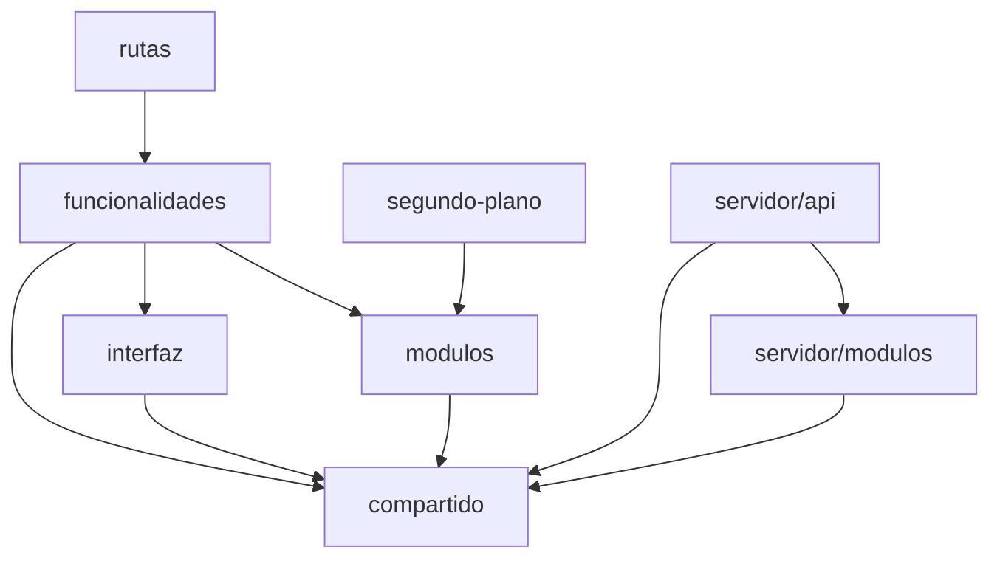
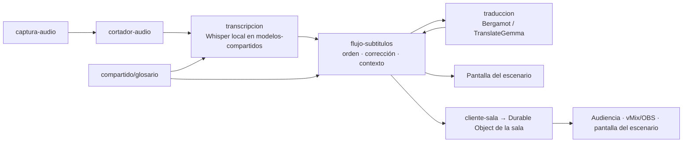

# Arquitectura

## Zonas

| Zona | Corre en | Contiene |
| --- | --- | --- |
| `navegador/` | Navegador | La app React: `arranque/`, `rutas/` (páginas finas), `funcionalidades/` (dominio), `modulos/` ♻, `interfaz/` ♻, `segundo-plano/` (Web Workers) |
| `compartido/` | Navegador **y** servidor | Código puro, sin DOM ni APIs de Cloudflare: `contratos/` (API y WebSocket) y módulos ♻ puros (glosario, exportar subtítulos, métricas) |
| `servidor/` | Cloudflare | Un solo Worker: `entrada/` (enrutador), `api/`, `objetos-durables/`, `modulos/` ♻, `plataforma/` |
| `migraciones/` | D1 | Esquema de la base: única fuente de verdad |

## Reglas de import (las hace cumplir `eslint-plugin-boundaries`)

- `modulos/`, `interfaz/`, `servidor/modulos/` y los módulos de `compartido/` son ♻: **no importan nada de fuera de su carpeta, salvo `compartido/contratos` cuando hace falta**.
- Un módulo ♻ **no importa a otro módulo ♻** salvo que su README lo declare (por ejemplo, `flujo-subtitulos` recibe el transcriptor y el traductor por parámetro; no los importa).
- `navegador/` y `servidor/` **nunca** se importan entre sí: se hablan por `compartido/contratos` (HTTP y WebSocket), validado en los dos lados.
- Una funcionalidad no importa a otra; lo que comparten sube a `modulos/`, `interfaz/` o `compartido/`.
- `rutas/` solo arma la página con componentes de `funcionalidades/`: sin lógica.

## Flujo de una sala (local)

En modo nube, `transcripcion` usa el motor de Workers AI (a través de `servidor/api/transcribir`, con una frase en WAV por pedido); todo lo demás es igual. La sala vuelve a abrir sola la entrada de audio si se corta (hasta 3 veces).

## Reparto a la audiencia: se genera una vez por sala, no por espectador

- **La computadora de cada sala** transcribe y traduce **su** sala a los idiomas que el organizador eligió para esa sala (por ejemplo, ES + EN + PT). No se traduce a "todos los idiomas": solo a los de la sala.
- Cada línea sale **una sola vez** hacia el Durable Object de la sala con el original y todas sus traducciones (`{ original, es, en, pt }`, unos cientos de bytes).
- El Durable Object la reenvía a todos los conectados. **El espectador no corre ningún modelo**: recibe texto y elige qué idioma mostrar de lo que ya llegó.
- Cambiar de idioma en el celular es instantáneo y no genera nada nuevo. Quien entra tarde recibe el historial reciente.
- Costo por espectador: una conexión WebSocket (los mensajes salientes no se cobran). Costo de IA por espectador: cero.

## Operación desatendida

- La pestaña manda señales al Durable Object de la sala; el Durable Object usa una **alarma** para detectar si la sala se calló, y sabe qué charla de la agenda está en curso para guardar lo que se transcribe.
- Los avisos salen **del servidor** (`servidor/modulos/avisos`, `servidor/plataforma/avisos-por-webhook.ts`), nunca de la computadora de la sala: llegan aunque esté apagada.
- Los botones de los avisos son links de un solo uso que vencen a los 15 minutos (`servidor/api/acciones.ts`).

Detalle y decisiones: documento de decisiones → "Operación desatendida y diferenciales".
